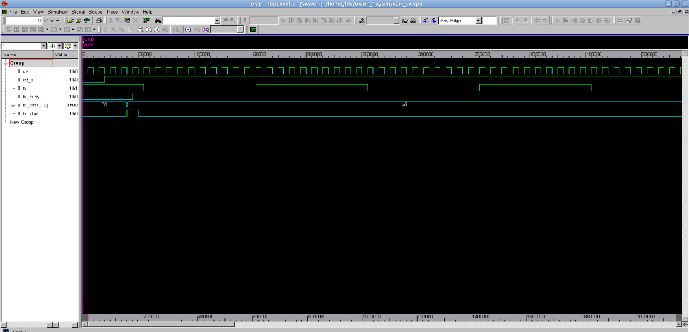
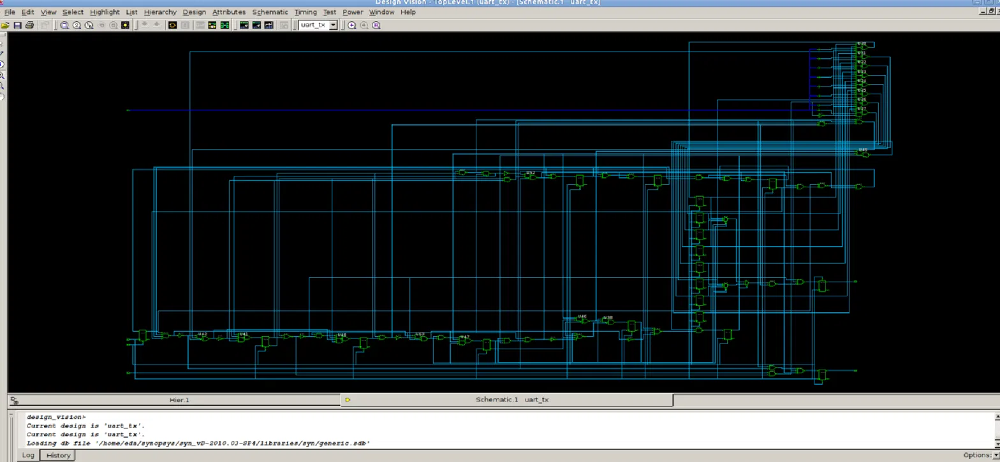
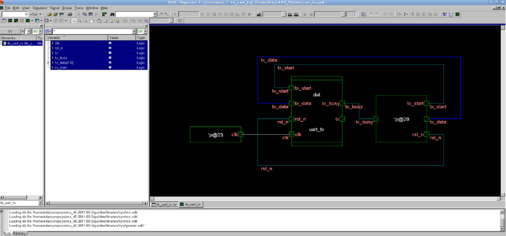
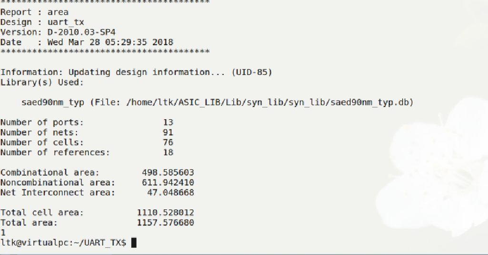
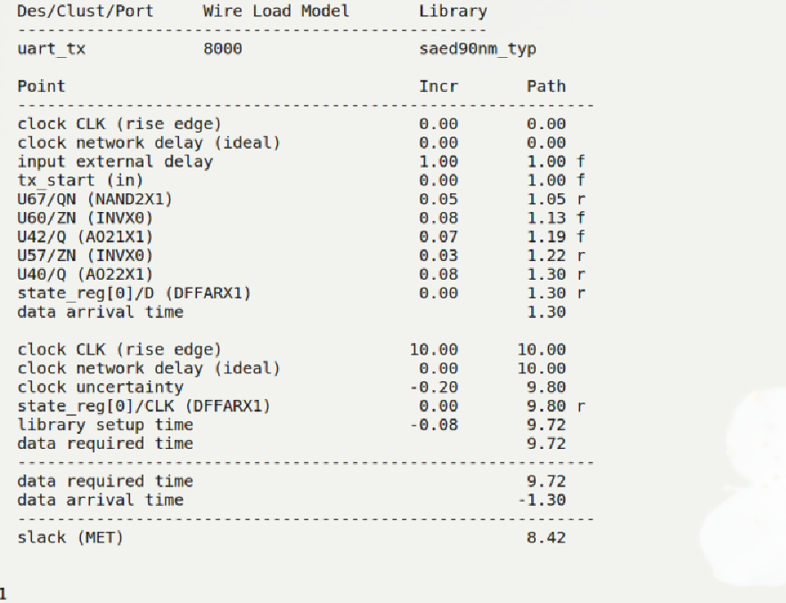
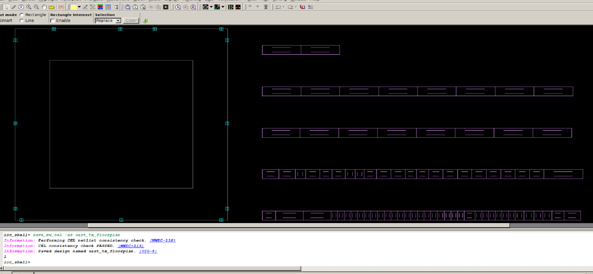
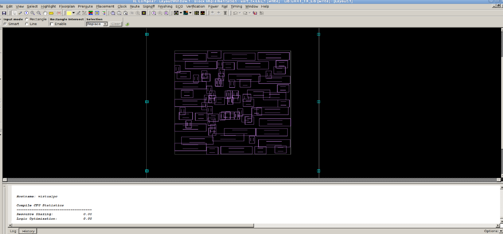
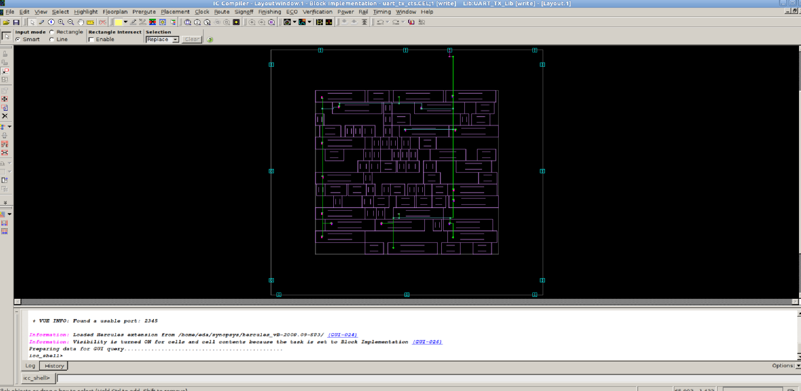
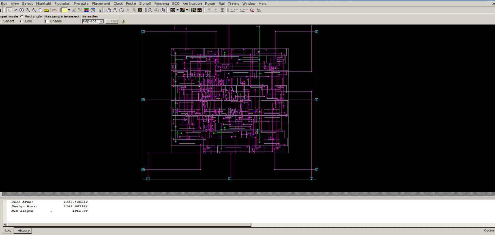
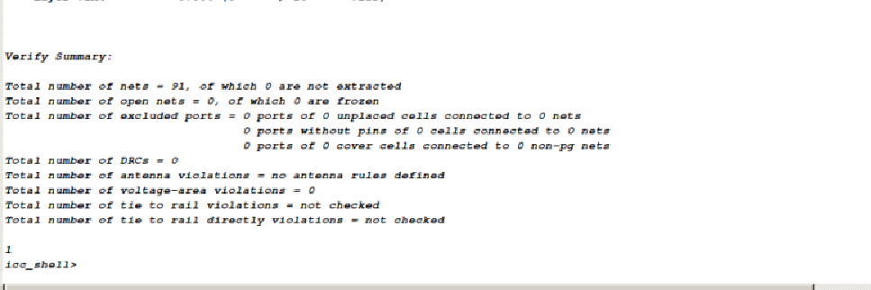

# UART TX — ASIC Physical Design Full Flow

A UART Transmitter implemented in SystemVerilog and taken through a complete ASIC physical design flow using Synopsys tools.

---

## 1. Project Overview

This project demonstrates the implementation of a UART Transmitter from RTL design to physical implementation.

The complete ASIC design flow includes:

**RTL → Simulation → SDC → Synthesis → Floorplan → Placement → CTS → Routing → STA → GDS**

The design was implemented using a **90 nm standard-cell technology library**.

---

## 2. Design Flow

```text
RTL Design
    │
    ▼
VCS Simulation
    │
    ▼
SDC Timing Constraints
    │
    ▼
Design Compiler
    │
    ├── Logic Synthesis
    ├── Area Analysis
    └── Timing Analysis
    │
    ▼
IC Compiler
    │
    ├── Floorplanning
    ├── Placement
    ├── Clock Tree Synthesis
    └── Routing
    │
    ▼
PrimeTime
    │
    ├── Setup Analysis
    └── Hold Analysis
    │
    ▼
Final GDS
```

---

## 3. RTL Design

The UART Transmitter is described using SystemVerilog RTL.

Main RTL source:

```text
rtl/uart_tx.sv
```

The design was verified using a dedicated testbench:

```text
rtl/tb_uart_tx.sv
```

Top-level module:

```text
uart_tx
```

---

## 4. RTL Simulation

RTL simulation was performed using **Synopsys VCS**.

The testbench verifies the functional behavior of the UART Transmitter before synthesis.

### Simulation Waveform



---

## 5. Logic Synthesis

Logic synthesis was performed using **Synopsys Design Compiler**.

The RTL was synthesized into a gate-level netlist using the SAED 90 nm standard-cell library.

### Gate-Level Schematic





### Area Report



### Timing Report



Generated netlist:

```text
netlist/uart_tx_NL.v
```

---

## 6. Physical Design

Physical implementation was performed using **Synopsys IC Compiler**.

### Floorplanning

A core utilization of approximately **70%** was used for the initial floorplan.



---

### Placement

Standard cells were placed inside the core area while considering timing and routing constraints.



After placement:

| Parameter       | Result |
| --------------- | -----: |
| Core Utilization | ~70% |
| Leaf Cells       | 76 |
| Design Area      | 1146.98 |

---

### Clock Tree Synthesis

Clock Tree Synthesis (CTS) was performed to distribute the clock signal across the design.



After CTS:

After CTS:

| Parameter                   |   Result |
| --------------------------- | -------: |
| Critical Path               | 0.39 ns |
| Setup Slack                 | +8.33 ns |
| TNS                         | 0 ns |
| Violating Paths             | 0 |
| Hold Violation              | 0 |
| Leaf Cells                  | 76 |
| Clock Buffer/Inverter Cells | 0 |

---

### Routing

Global and detailed routing were performed using IC Compiler.

After routing:

| Parameter              | Result |
| ---------------------- | -----: |
| Setup WNS              | 0 ns |
| TNS                    | 0 ns |
| Hold WNS               | 0 ns |
| DRC Violating Nets     | 0 |
| Route Violations       | 0 |
| Open Nets              | 0 |
| Detail Routing DRC     | 0 |
| Peak Horizontal Congestion | 57.14% |
| Peak Vertical Congestion   | 37.50% |
| Total Wire Length      | ~1926 µm |



---

## 7. Physical Verification

Route verification was performed using the IC Compiler `verify_zrt_route` command.

The verification reported:

| Parameter      | Result |
| -------------- | -----: |
| DRC Violations |      0 |
| Open Nets      |      0 |
| Routing Errors |      0 |



> Note: Antenna checking was not performed because antenna rules were not defined in the available technology setup.

---

## 8. Static Timing Analysis

Static Timing Analysis was performed using **Synopsys PrimeTime**.

### Setup Analysis

Worst reported setup slack:

```text
+8.42 ns
```

### Hold Analysis

Worst reported hold slack:

```text
+0.03 ns
```

PrimeTime reports:

```text
pt/reports/setup.rpt
pt/reports/hold.rpt
```

---

## 9. Final Layout

The final routed design was exported as a **GDSII** file.

```text
uart_tx.gds
```


## 10. Key Results

| Parameter              |     Result |
| ---------------------- | ---------: |
| Technology             | SAED 90 nm |
| Clock Period           |      10 ns |
| Clock Frequency        |    100 MHz |
| Core Utilization       |       ~70% |
| Leaf Cells             |         76 |
| Total Nets             |         91 |
| Cell Area              |    1110.53 |
| Design Area            |    1146.98 |
| CTS Setup Slack        |   +8.33 ns |
| CTS Hold Violation     |          0 |
| Routed Setup Slack     |   +8.33 ns |
| Total Negative Slack   |          0 |
| Routing Net Violations |          0 |
| DRC Violations         |          0 |
| Open Nets              |          0 |
| PT Setup Slack         |   +8.42 ns |
| PT Hold Slack          |   +0.03 ns |

---

## 11. Tools

| Design Stage           | Tool                     |
| ---------------------- | ------------------------ |
| RTL Design             | SystemVerilog            |
| Simulation             | Synopsys VCS / DVE       |
| Logic Synthesis        | Synopsys Design Compiler |
| Physical Design        | Synopsys IC Compiler     |
| Static Timing Analysis | Synopsys PrimeTime       |
| Final Layout           | GDSII                    |
